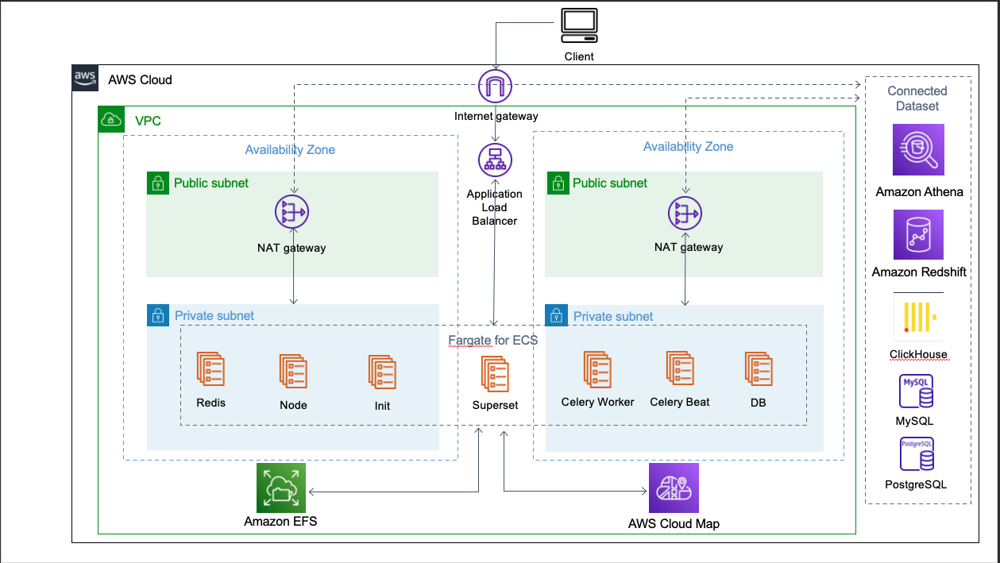

:xrefstyle: short

Deploying this Quick Start for a new virtual private cloud (VPC) with
default parameters builds the following {partner-product-short-name} environment in the
AWS Cloud.

[#architecture1]
.Quick Start architecture for {partner-product-short-name} on AWS

As shown in <<architecture1>>, the Quick Start sets up the following:

* A highly available architecture that spans two Availability Zones.*
* A VPC configured with public and private subnets, according to AWS
best practices, to provide you with your own virtual network on AWS.*
* A managed internet gateway to direct inbound traffic to an Application Load Balancer, which manages traffic to the Fargate cluster.
* In the public subnets, managed network address translation (NAT) gateways to provide outbound
internet access for resources in the private subnets.*
* In the private subnets:
** An Amazon ECS cluster using Fargate to provide all Superset functions, including the core system, cache, database, message queue, and frontend.
** Amazon EFS to provide metadata, query cached-data persistency, and share service modules.
** AWS Cloud Map, a discovery service for application resources.
* Amazon Athena, a serverless, interactive query service to query data and analyze big data in Amazon S3 using standard SQL.
* Amazon Redshift, a fully managed, petabyte-scale data warehouse service.
** A MySQL instance, which is included with ClickHouse.
** A Postgres instance, which is included with ClickHouse.

[.small]#* The template that deploys the Quick Start into an existing VPC skips the components marked by asterisks and prompts you for your existing VPC configuration.#
